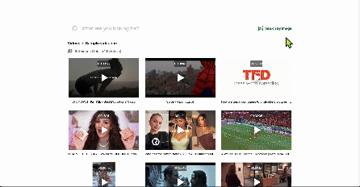

## Introduction

⭐️ Check out the [Demo](https://wb-demo.vercel.app/)!

<div align="center">
  <a href="https://wb-demo.vercel.app/">
    
  </a>
</div>

With this tool, you can search for videos using images either from your device or via a public image URL. Start by uploading or linking an image to initiate a search. You can then crop the image as desired and perform successive searches based on the cropped versions. This iterative search capability allows you to refine your queries and find the most relevant video content effortlessly!

## Image Prerequisites

The images you wish to use must meet the following requirements:

- Format: JPEG and PNG. (\* Public image URLs should end with .jpg, .jpeg, or .png)
- Dimension: Must be larger than 378x378 pixels.
- Size: Must not exceed 5MB.
- Object visibility: Ensure that the objects of interest are visible and occupy at least 50% of the video frame. This helps the platform accurately identify and match the objects.

## How to Start the App Locally

### Step 1. Generate Twelve Labs API key

Visit [Twelve Labs Playground](https://playground.twelvelabs.io/) to generate your API Key

- Upon signing up, you'll receive free credits to index up to 10 hours of video content!

### Step 2. Clone the current repo

```sh
git clone git@github.com:mrnkim/wb-demo.git
```

### Step 3. Create `.env` file in the root directory and provide the values for each key

```
 TWELVELABS_API_KEY=<YOUR API KEY>
 TWELVELABS_INDEX_ID=<YOUR INDEX ID>
```

- Check [here](https://docs.twelvelabs.io/docs/create-indexes) on how to create an index and get the index id

### Step 4. Install and start the client

```
npm install
npm run dev
```

### Step 5. Open [http://localhost:3000](http://localhost:3000) with your browser to see the result.
